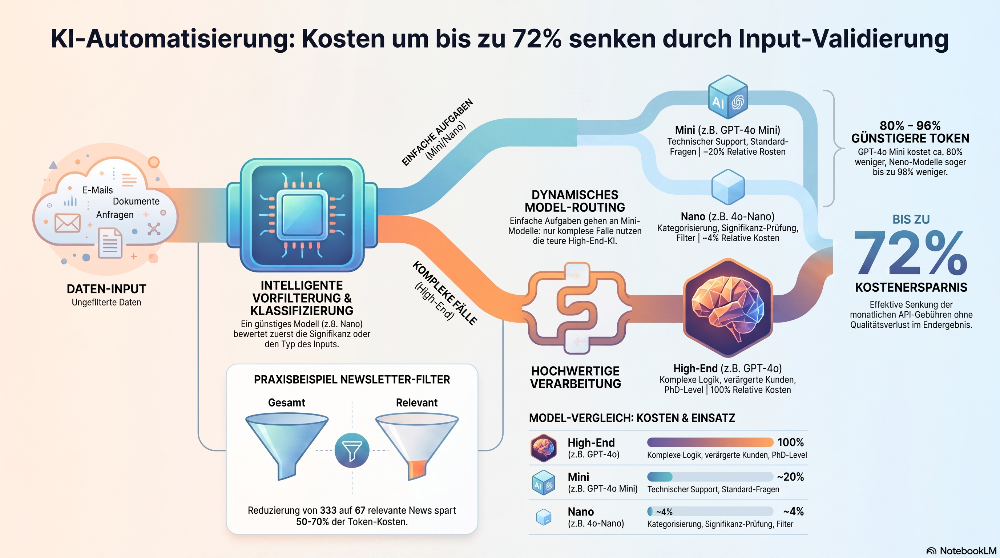

# Täglicher Newsletter mit RSS (n8n Workflow)

Zwei n8n-Workflows für automatisierte Tages-Newsletter per RSS: RSS-Feeds werden gesammelt, auf die letzten 24h gefiltert, per Nano-Modell auf Relevanz vorqualifiziert und von einem Redakteur-Agent zu einer finalen Nachricht zusammengefasst, die per Gmail verschickt wird.

## Inhalt

- `AI News.json` – n8n-Workflow: KI-News aus OpenAI Blog, MIT Technology Review, Techcrunch, Google AI Blog
- `Nachrichtenextraktor.json` – n8n-Workflow: Tagesnachrichten aus Tagesschau/ARD, ZDF, Deutschlandfunk, Correctiv
- `KI-Kosten_durch_Vorfilterung_effizient_senken.png` – Infografik zum Workflow
- `Screenshot 2026-07-17 122755.png` – Screenshot
- `einleitung.txt` – Begleitartikel: Kosteneinsparung durch Input-Validierung & Modell-Routing

## Übersicht

## Screenshots

## Setup

1. `AI News.json` und/oder `Nachrichtenextraktor.json` in n8n importieren
2. Credentials verknüpfen: RSS-Feeds (kein Auth nötig), OpenRouter API (gpt-5-nano, gpt-5), Gmail
3. Schedule Trigger konfigurieren und Workflow aktivieren

## Funktionsweise

1. **Sammeln**: RSS Feed Read Nodes holen Artikel aus mehreren Quellen, werden per Merge zusammengeführt
2. **Zeit-Filter**: `<24h?` verwirft alles Ältere als 24 Stunden
3. **Vorqualifizierung**: `Qualifizierer` (gpt-5-nano) bewertet Relevanz günstig vor, `AI related?` / `Significant?` filtern verworfene Items aus
4. **Redaktion**: `Redakteur`-Agent (gpt-5) fasst die verbliebenen, relevanten Meldungen zu einer Newsletter-Nachricht zusammen
5. **Versand**: Gmail-Node verschickt die fertige Zusammenfassung

## Verwendete Nodes

- Schedule Trigger, RSS Feed Read, Merge, Filter, Aggregate, Set
- AI Agent (Redakteur), Chain LLM (Qualifizierer), Structured Output Parser
- OpenRouter Chat Model (gpt-5-nano, gpt-5)
- Gmail
